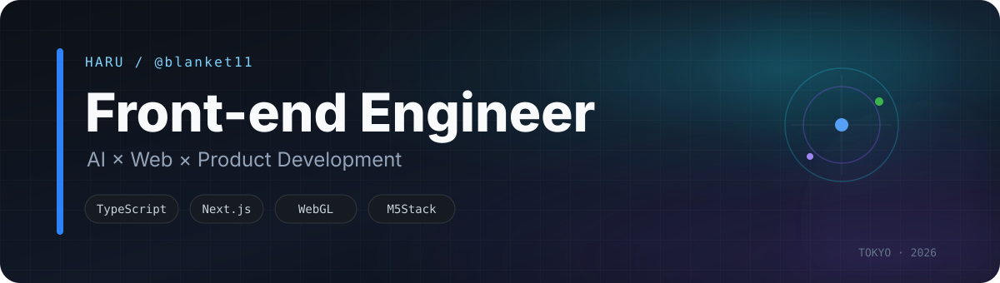
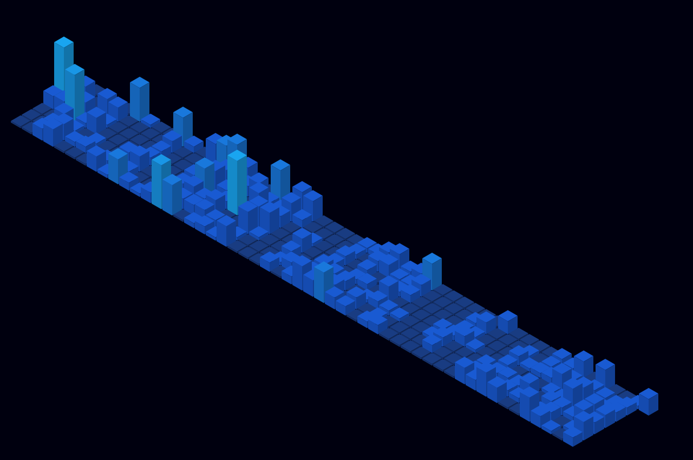

  <a href="https://me.push.tokyo/"><strong>Portfolio ↗</strong></a>
  &nbsp;&nbsp;·&nbsp;&nbsp;
  <a href="https://x.com/halbk11">X / @halbk11 ↗</a>

Webプロダクトを作るフロントエンドエンジニアです。  
最近は **AIを前提にした開発**、Webの体験設計、個人プロダクト、WebGL / デバイス連携を中心に手を動かしています。

## Now building

<table>
  <tr>
    <td width="50%" valign="top">
      <h3>Kokoiku</h3>
      
ライブやイベントの予定共有から、現場ログ・遠征・Cue連携までをまとめる推し活Webサービス。

      
<code>Next.js</code> <code>TypeScript</code> <code>Supabase</code>

      <a href="https://www.kokoiku.me/">kokoiku.me ↗</a>
    </td>
    <td width="50%" valign="top">
      <h3>HAZUMI</h3>
      
今の状態・活動・目標・時間から、作業や休息へ入るための音楽ルートをつくるWebアプリ。

      
<code>TypeScript</code> <code>Web Audio</code> <code>Cloudflare</code>

      <a href="https://hazumi.push.tokyo/">hazumi.push.tokyo ↗</a>
    </td>
  </tr>
  <tr>
    <td width="50%" valign="top">
      <h3>Kokoiku Cue</h3>
      
次のライブまでのカウントダウンと NOW LIVE、チェキ券管理を行う首掛けデバイス。

      
<code>M5Stack</code> <code>ESP32</code> <code>LVGL</code>

      <a href="https://github.com/blanket11/kokoiku-cue">Repository ↗</a>
    </td>
    <td width="50%" valign="top">
      <h3>DOG MOD</h3>
      
現実のDOGへスマホカメラを向け、3D形状を合わせて虹色のMOD演出を重ねるWeb作品。

      
<code>Three.js</code> <code>WebGL</code> <code>Computer Vision</code>

      <a href="https://mod.r-a-y.fan/">mod.r-a-y.fan ↗</a>
    </td>
  </tr>
  <tr>
    <td colspan="2" valign="top">
      <h3>me.push.tokyo</h3>
      
勉強会やイベントでそのままデジタル名刺として使える、作品・SNSへの入口をまとめた個人Web。

      
<code>Next.js</code> <code>TypeScript</code> <code>Cloudflare Pages</code>

      <a href="https://me.push.tokyo/">Open portfolio ↗</a>
    </td>
  </tr>
</table>

## Working stack

<code>TypeScript</code> · <code>React</code> · <code>Next.js</code> · <code>Supabase</code> · <code>Cloudflare</code> · <code>Three.js / WebGL</code> · <code>M5Stack / ESP32</code>

AIを「補助ツール」ではなく、設計・実装・レビュー・検証まで含めた開発フローの一部として使っています。

## Contribution activity

GitHubの草を3Dで可視化しています。公開リポジトリだけに偏る言語比率やコミット集計は出さず、**Contributionの推移そのもの**を表示しています。

## Recent public activity

<!-- RECENT_ACTIVITY:start -->
- `2026-09-16` Created branch `codex/kokoiku-cue-official-firmware` in [blanket11/kokoiku-cue](https://github.com/blanket11/kokoiku-cue)
- `2026-09-16` Created branch `main` in [blanket11/kokoiku-cue](https://github.com/blanket11/kokoiku-cue)
<!-- RECENT_ACTIVITY:end -->

Recent Activity shows public GitHub events only. Private repository names and activity are not exposed here.
